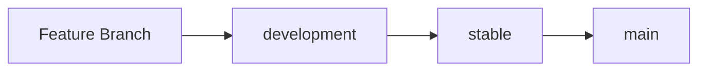

# 🌿 Novara MVP - Git Branching Strategy

## **Branch Overview**

### **🏠 `main`** - Production Ready
- **Purpose**: Latest stable, tested code ready for production
- **Protection**: Always working, thoroughly tested
- **Deployment**: This branch could be deployed to production anytime
- **Merge From**: `stable` branch only (via PR)

### **🔒 `stable`** - Feature Complete & Tested  
- **Purpose**: Feature-complete code that's been tested and verified
- **Protection**: All features working, no known bugs
- **Testing**: Manual testing completed, ready for final review
- **Merge From**: `development` branch (via PR)

### **🚧 `development`** - Active Development
- **Purpose**: Integration branch for new features and improvements
- **Protection**: May have experimental features, work in progress
- **Testing**: Basic functionality verified, but ongoing development
- **Merge From**: Feature branches, direct commits for small changes

---

## **🔄 Workflow**



### **Daily Development**
1. **Work on `development`** for new features
2. **Test thoroughly** before moving to `stable`
3. **Merge to `stable`** when features are complete and tested
4. **Merge to `main`** when ready for production release

### **Feature Development**
1. Create feature branch from `development`
2. Develop and test feature
3. Create PR to merge back into `development`
4. Delete feature branch after merge

---

## **🛡️ Branch Protection Rules**

### **Recommended GitHub Settings:**

#### **`main` Branch**
- ✅ Require pull request reviews
- ✅ Require status checks to pass
- ✅ Require branches to be up to date
- ✅ Include administrators

#### **`stable` Branch**  
- ✅ Require pull request reviews
- ✅ Require status checks to pass

#### **`development` Branch**
- ⚠️ More flexible, allow direct pushes for rapid iteration

---

## **📋 Current Status**

- **`main`**: ✅ Stable onboarding flow with working welcome page
- **`stable`**: ✅ Same as main (just created)
- **`development`**: 🚧 Ready for next features

---

## **🚀 Next Steps**

You're now set up for stable development! 

### **For New Features:**
```bash
# Start working on development
git checkout development

# Create feature branch (optional)
git checkout -b feature/new-feature-name

# When ready to stabilize
git checkout stable
git merge development

# When ready for production
git checkout main  
git merge stable
```

### **Quick Commands:**
```bash
# Check current branch
git branch

# Switch to development
git checkout development

# See all branches
git branch -a

# Push current branch
git push origin HEAD
```

---

## **🎯 Benefits**

- ✅ **`main` always works** - can deploy anytime
- ✅ **`stable` is tested** - confidence in releases  
- ✅ **`development` is flexible** - rapid iteration
- ✅ **Clear progression** - development → stable → main
- ✅ **Risk management** - isolate experimental work

Happy coding! 🎉 