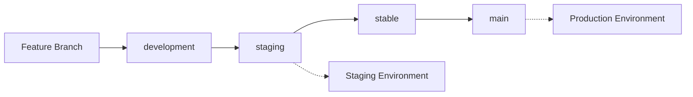

# 🌿 Branch Strategy Analysis & Recommendations

## **Date**: July 26, 2025

---

## **✅ Branch Cleanup Complete**

### **Deleted Stale Remote Branches:**
- ✅ `cursor/configure-vercel-railway-api-integration-0a29`
- ✅ `feature/vercel-preview-detection` 
- ✅ `test/vercel-preview-detection`

### **Current Clean Branch Structure:**
```
origin/HEAD -> origin/main
origin/development
origin/fix/railway-staging-deployment
origin/housekeeping/repo-reorg
origin/main
origin/stable
origin/staging
```

---

## **🔍 Current Branch Strategy Assessment**

### **✅ What's Working Well**

1. **Clear Branch Hierarchy**: `development → staging → stable → main`
2. **Environment Mapping**: Each branch maps to specific environment
3. **Documentation**: Comprehensive branching strategy documented
4. **Branch Protection**: Main branch has strong protection rules
5. **Staging Environment**: Dedicated staging for safe testing

### **⚠️ Areas for Improvement**

#### **1. Branch Usage Patterns**
**Current Reality vs. Strategy:**
- **Strategy**: Use `development` for active work
- **Reality**: Most work happens directly on `main` or `staging`
- **Issue**: Bypassing the intended workflow

#### **2. Feature Branch Usage**
**Current Reality vs. Strategy:**
- **Strategy**: Create feature branches for new work
- **Reality**: Minimal feature branch usage
- **Issue**: No isolation of experimental work

#### **3. Merge Strategy**
**Current Reality vs. Strategy:**
- **Strategy**: Progressive merges (dev → staging → stable → main)
- **Reality**: Direct merges to main/staging
- **Issue**: Bypassing safety checks

---

## **🚨 Critical Issues Identified**

### **1. Workflow Bypass**
```bash
# ❌ CURRENT: Direct work on main
git checkout main
# ... make changes ...
git commit -m "fix: something"
git push origin main

# ✅ SHOULD BE: Feature branch workflow
git checkout development
git checkout -b feature/fix-something
# ... make changes ...
git commit -m "fix: something"
git push origin feature/fix-something
# Create PR: feature/fix-something → development
```

### **2. Missing Feature Isolation**
- No feature branches for experimental work
- All changes go directly to integration branches
- Risk of breaking stable code

### **3. Inconsistent Environment Testing**
- Some changes skip staging testing
- Direct deployments to production
- Increased risk of production issues

---

## **🎯 Recommended Sustainable Branch Strategy**

### **Updated Workflow**



### **1. Feature Development**
```bash
# ✅ CORRECT: Feature branch workflow
git checkout development
git checkout -b feature/AN-02-churn-risk-flag
# ... develop feature ...
git commit -m "feat: Add churn risk flagging system"
git push origin feature/AN-02-churn-risk-flag
# Create PR: feature/AN-02-churn-risk-flag → development
```

### **2. Integration Testing**
```bash
# ✅ CORRECT: Progressive integration
git checkout staging
git merge development
git push origin staging  # Auto-deploys to staging
# Test in staging environment
```

### **3. Production Release**
```bash
# ✅ CORRECT: Safe production deployment
git checkout stable
git merge staging
# Final testing in stable
git checkout main
git merge stable  # Auto-deploys to production
```

---

## **🛠️ Implementation Plan**

### **Phase 1: Immediate Fixes (This Week)**

1. **Enforce Feature Branch Usage**
   - Create feature branch for every change
   - Use PR workflow for all merges
   - No direct commits to main/staging

2. **Update Cursor Rules**
   - Add branch strategy enforcement
   - Require feature branch creation
   - Prevent direct main commits

3. **Branch Protection Enhancement**
   - Protect staging branch
   - Require PR reviews for all branches
   - Add status checks

### **Phase 2: Automation (Next Week)**

1. **Automated Branch Creation**
   - Script to create feature branches
   - Automatic branch naming conventions
   - Integration with roadmap epics

2. **PR Templates**
   - Standardized PR descriptions
   - Checklist for testing
   - Epic/story mapping

3. **Deployment Automation**
   - Automated staging deployments
   - Production deployment gates
   - Rollback procedures

### **Phase 3: Monitoring (Ongoing)**

1. **Branch Health Monitoring**
   - Track branch usage patterns
   - Identify workflow violations
   - Measure deployment success rates

2. **Performance Metrics**
   - Time from feature to production
   - Number of hotfixes needed
   - Deployment success rate

---

## **📋 Action Items**

### **Immediate (Today)**
- [ ] Update Cursor rules to enforce feature branch usage
- [ ] Create feature branch for next development work
- [ ] Document current branch strategy violations

### **This Week**
- [ ] Implement branch protection for staging
- [ ] Create PR templates
- [ ] Train team on new workflow

### **Next Week**
- [ ] Automate branch creation scripts
- [ ] Set up deployment monitoring
- [ ] Review and refine strategy

---

## **🎯 Success Metrics**

### **Short Term (1 Month)**
- ✅ 100% feature branch usage
- ✅ 0 direct commits to main
- ✅ All changes go through staging

### **Medium Term (3 Months)**
- ✅ < 2 hours from feature to staging
- ✅ < 1 week from staging to production
- ✅ < 5% deployment failures

### **Long Term (6 Months)**
- ✅ Fully automated deployment pipeline
- ✅ Zero manual deployment steps
- ✅ 99.9% deployment success rate

---

## **🚀 Conclusion**

Our current branch strategy is **well-designed but poorly followed**. The main issue is **workflow bypass** - we have good rules but don't follow them consistently.

**The fix is simple**: Enforce feature branch usage and progressive integration. This will:
- ✅ Reduce production risks
- ✅ Improve code quality
- ✅ Enable better testing
- ✅ Support team collaboration

**Next step**: Update Cursor rules to enforce this workflow automatically. 