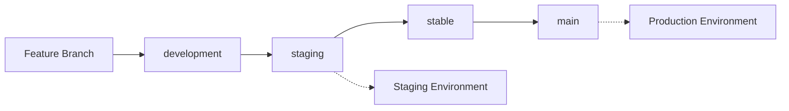

# 🌿 Novara MVP - Git Branching Strategy

## **Branch Overview**

### **🏠 `main`** - Production Ready
- **Purpose**: Latest stable, tested code ready for production
- **Protection**: Always working, thoroughly tested
- **Deployment**: Auto-deploys to production (Railway + Vercel)
- **Merge From**: `stable` branch only (via PR)

### **🔒 `stable`** - Feature Complete & Tested  
- **Purpose**: Feature-complete code that's been tested in staging
- **Protection**: All features working, no known bugs
- **Testing**: Manual testing completed, ready for final review
- **Merge From**: `staging` branch (via PR)

### **🧪 `staging`** - Staging Environment (NEW!)
- **Purpose**: Testing branch connected to staging environment
- **Deployment**: Auto-deploys to staging (Railway + Vercel staging)
- **Database**: Uses staging Airtable base (`appEOWvLjCn5c7Ght`)
- **Testing**: Safe environment for integration testing
- **Merge From**: `development` branch

### **🚧 `development`** - Active Development
- **Purpose**: Integration branch for new features and improvements
- **Protection**: May have experimental features, work in progress
- **Testing**: Basic functionality verified, but ongoing development
- **Merge From**: Feature branches, direct commits for small changes

---

## **🔄 Updated Workflow**



### **Modern Development Flow**
1. **Work on `development`** for new features
2. **Merge to `staging`** → Auto-deploys to staging environment
3. **Test in staging** → Validate with staging database
4. **Merge to `stable`** → When staging tests pass
5. **Merge to `main`** → Auto-deploys to production

### **Critical Bug Fixes (Fast Track)**
1. **Create hotfix branch** from `main`
2. **Test in staging first** (merge to `staging` temporarily)
3. **Merge directly to `main`** after validation

---

## **🛡️ Branch Protection Rules**

### **Recommended GitHub Settings:**

#### **`main` Branch**
- ✅ Require pull request reviews
- ✅ Require status checks to pass
- ✅ Require branches to be up to date
- ✅ Include administrators
- 🚀 **Auto-deploy**: Production Railway + Vercel

#### **`stable` Branch**  
- ✅ Require pull request reviews
- ✅ Require status checks to pass

#### **`staging` Branch**
- ⚠️ Allow direct pushes for rapid testing
- 🧪 **Auto-deploy**: Staging Railway + Vercel
- 📊 **Database**: Staging Airtable base

#### **`development` Branch**
- ⚠️ More flexible, allow direct pushes for rapid iteration

---

## **🌐 Environment Mapping**

| Branch | Environment | Database | URL |
|--------|------------|----------|-----|
| `main` | Production | Production Airtable | `novara-mvp.vercel.app` |
| `stable` | Pre-Production | Production Airtable | Manual deploys |
| `staging` | Staging | Staging Airtable | `novara-mvp-staging.vercel.app` |
| `development` | Local Dev | Local/Dev Airtable | `localhost:3000` |

---

## **📋 Current Status**

- **`main`**: ✅ Stable production deployment
- **`stable`**: ✅ Ready for production releases
- **`staging`**: 🧪 Connected to staging environment
- **`development`**: 🚧 Ready for next features

---

## **🚀 Next Steps**

You're now set up for proper DevOps! 

### **For New Features:**
```bash
# Start working on development
git checkout development

# Create feature branch (optional)
git checkout -b feature/new-feature-name

# When ready to test in staging
git checkout staging
git merge development
git push origin staging  # Deploys to staging

# When staging tests pass
git checkout stable
git merge staging

# When ready for production
git checkout main  
git merge stable  # Deploys to production
```

### **For Bug Fixes:**
```bash
# Quick test in staging
git checkout staging
git merge development
git push origin staging

# If staging tests pass, fast-track to production
git checkout main
git merge staging
```

### **Quick Commands:**
```bash
# Check current branch
git branch

# Switch to development
git checkout development

# See all branches
git branch -a

# Push current branch
git push origin HEAD
```

---

## **🎯 Benefits**

- ✅ **`main` always works** - can deploy anytime
- ✅ **`stable` is tested** - confidence in releases  
- ✅ **`staging` environment** - safe testing with real deployments
- ✅ **`development` is flexible** - rapid iteration
- ✅ **Clear progression** - development → staging → stable → main
- ✅ **Risk management** - isolate experimental work
- ✅ **Staging database** - no production data pollution

Happy coding! 🎉 