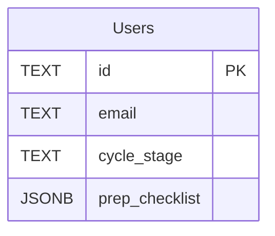

# AP-01 Database Schema — Prep Checklist Persistence

> **Feature**: AP-01 Cycle-Aware Appointment Prep Checklist  
> **Epic**: E2 Insight Polish  
> **Story ID**: AP-01  

## 🎯 Overview

AP-01 introduces a lightweight persistence layer for each user’s appointment-prep checklist. To minimise scope and avoid new relational tables in Sprint 1, the checklist state is stored as a **JSONB column** on the existing `Users` table.

* Rationale: Single-row look-ups, atomic update semantics, no JOINs required.
* Limitation: JSONB blobs can grow if we keep historical stages; mitigated by pruning on stage change (see Functional Logic).

## 🗄️ Schema Changes

### Users Table (SQLite & Postgres)
```sql
-- Migration 20250727_add_prep_checklist_column.sql
ALTER TABLE Users
    ADD COLUMN prep_checklist JSONB DEFAULT '{}' /* SQLite: use TEXT with JSON validation in code */;
```
* **SQLite note**: SQLite < 3.39 lacks native JSONB; we store TEXT and run `JSON_VALID` assertions in migration tests. The backend adapter auto-converts TEXT ↔ JSON objects.
* **Postgres note**: Uses database-native `JSONB` for indexing and partial updates (`jsonb_set`).

### Column Shape (example)
```json
{
  "cycle_stage": "stimulation",
  "completed_ids": ["stim_meds"],
  "display_count": 1,
  "last_updated": "2025-07-27T12:45:00Z"
}
```

## 🔄 Migration Strategy
1. **Idempotent** – `IF NOT EXISTS` guard for production deploy safety.
2. **Back-fill** – Set `{ "cycle_stage": null, "completed_ids": [] }` for existing users to avoid `NULL` handling.
3. **Rollback** – `ALTER TABLE Users DROP COLUMN prep_checklist` is safe (no dependencies).

## 🏎️ Performance Considerations
* **Row size impact**: JSON payload < 1 KB for typical stages.
* **Indexing**: No dedicated index in Sprint 1; we always query by `Users.id`. Future iterations may add GIN index on `prep_checklist ->> 'cycle_stage'` when we need stage-based segmentation.

## 🚨 Data Validation Rules
| Field | Validation | Failure Behaviour |
|-------|-----------|-------------------|
| `cycle_stage` | Must be one of `baseline`, `stimulation`, `retrieval`, `transfer` | Fallback to `baseline` mapping |
| `completed_ids` | Array of strings; values must exist in stage mapping | Ignore invalid IDs & log warning |
| `display_count` | Integer ≥ 0 | Reset to 0 on invalid data |

## 📐 ER Diagram (excerpt)


## ✅ Test Cases
* **Migration executes on SQLite & Postgres** (CI).
* **Insert / update** JSON passes validation.
* Excessive payload (>10 KB) triggers warning and truncation (analytics only).

---

> **Next iteration**: Consider separate `PrepChecklistItems` table for longitudinal analytics if AP-01 shows strong engagement. 